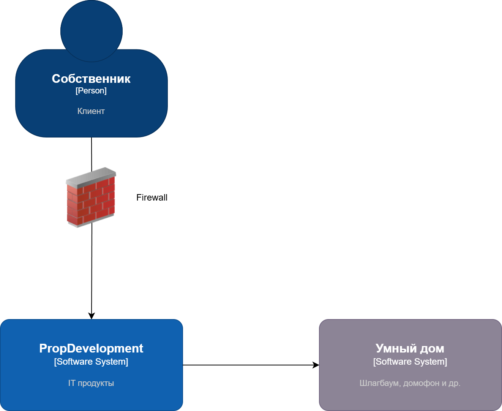
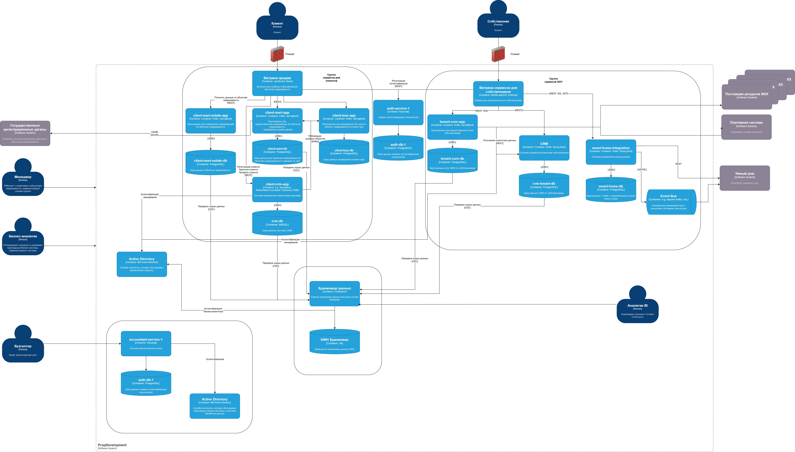

### [На главную](../README.md) - [К предыдущему упражнению](../Exc2/README.md) - [К следующему упражнению](../Exc4/README.md)

# Упражнение 3

## 1. Требования к внешним интеграциям

### 1.1 Требования к безопасности

#### Защита данных
- Все данные должны быть шифрованы при передаче (использование TLS 1.2+).
- Биометрические данные (при обработке) должны соответствовать стандартам защиты данных (GDPR, ФЗ-152).

#### Ограничение доступа:

- Партнёрские API должны предоставлять доступ только через авторизованные каналы.
- Минимизация выдаваемых данных: предоставлять только необходимые атрибуты (например, идентификатор пользователя).

#### Мониторинг и аудит:

- Логи взаимодействия должны сохраняться для отслеживания инцидентов.

### 1.2 Протоколы аутентификации и авторизации

- Использовать OAuth 2.0 для авторизации.
- Access и Refresh токены для сеансов взаимодействия.
- Возможное расширение на OIDC (OpenID Connect) для управления аутентификацией.
JWT (JSON Web Token):
- Использование токенов для передачи прав доступа между партнёром и PropDevelopment.
- Токены должны быть подписаны и иметь ограниченное время жизни.

### 1.3 Организация взаимодействия

#### API-шлюз:
- Все взаимодействия проходят через центральный шлюз PropDevelopment.
- Шлюз отвечает за маршрутизацию, контроль доступа и сбор аналитики.

#### Асинхронное взаимодействие:
- Использовать очереди сообщений или вебхуки для событий (например, распознавание лица или номера автомобиля).

#### Failover:
- Обеспечить механизмы восстановления при сбоях (например, повторные попытки запроса).

#### Документирование API:
- Описания контрактов API должны быть в формате OpenAPI (Swagger).

#### Разграничение ответственности:
- Управление устройствами (домофон, шлагбаум) остаётся на стороне партнёра.
- PropDevelopment только инициирует действия и получает уведомления о статусах.

## 2. Диаграммы C4

### 2.1 Диаграмма C4 - контекст
[PropDevelopment_С4_model_context.drawio.xml](./PropDevelopment_С4_model_context.drawio.xml)

### 2.2 Диаграмма C4 - контейнеры

[PropDevelopment_С4_model_container.drawio.xml](./PropDevelopment_С4_model_container.drawio.xml)

### [На главную](../README.md) - [К предыдущему упражнению](../Exc2/README.md) - [К следующему упражнению](../Exc4/README.md)